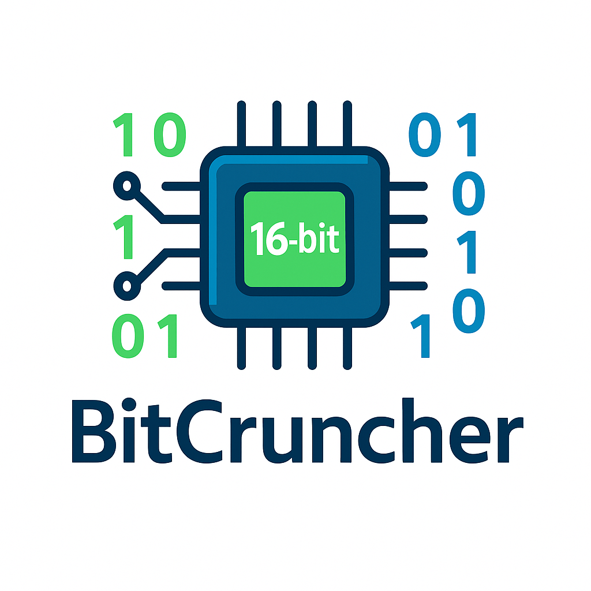

# BitCruncher CPU Project

[](https://github.com/SCaAg/BitCruncher/blob/main/doc/bitcruncher.png)

A 16-bit microprocessor implementation with microprogram-controlled instruction execution, featuring a complete toolchain including assembler, RTL design, and simulation environment.

## Project Overview

BitCruncher is a simple yet functional CPU design that implements:
- 16-bit data path with 8-bit addressing
- Microprogram-controlled instruction execution
- 13 instruction types including arithmetic, logic, and control flow
- Complete assembly toolchain with Python-based assembler
- Comprehensive Verilog RTL implementation
- Full simulation and verification environment

## Architecture

### CPU Specifications
- **Data Width**: 16 bits
- **Address Width**: 8 bits (256 memory locations)
- **Instruction Format**: 16 bits (8-bit opcode + 8-bit address)
- **Memory**: 256 × 16-bit words
- **Control**: Microprogram-based control unit

### Instruction Set Architecture

| Instruction | Opcode | Description |
|-------------|--------|-------------|
| STORE X     | 00000001 | ACC → [X] |
| LOAD X      | 00000010 | [X] → ACC |
| ADD X       | 00000011 | ACC + [X] → ACC |
| SUB X       | 00000100 | ACC - [X] → ACC |
| JMPGEZ X    | 00000101 | If ACC ≥ 0 then X → PC |
| JMP X       | 00000110 | X → PC |
| HALT        | 00000111 | Halt program execution |
| MPY X       | 00001000 | ACC × [X] → ACC |
| AND X       | 00001010 | ACC & [X] → ACC |
| OR X        | 00001011 | ACC \| [X] → ACC |
| NOT X       | 00001100 | ~[X] → ACC |
| SHIFTR      | 00001101 | Shift [X] right 1 bit → ACC |
| SHIFTL      | 00001110 | Shift [X] left 1 bit → ACC |

## Project Structure

```
BitCruncher/
├── assembly/           # Assembly tools and programs
│   ├── assembler.py    # Python-based assembler
│   ├── test_program.asm # Comprehensive test program
│   ├── sum.asm         # Simple addition program
│   ├── mpy_test.asm    # Multiplication test
│   └── mpy_test.bin    # Assembled binary
├── rtl/                # Verilog RTL implementation
│   ├── CPU_top.v       # Top-level CPU module
│   ├── CU.v            # Microprogram control unit
│   ├── ALU.v           # Arithmetic logic unit
│   ├── ALU_ACC.v       # ALU with accumulator
│   ├── PC.v            # Program counter
│   ├── MAR.v           # Memory address register
│   ├── MBR.v           # Memory buffer register
│   ├── IR.v            # Instruction register
│   ├── BR.v            # Buffer register
│   └── include/        # Header files
│       └── instruction_set.vh # Instruction definitions
├── sim/                # Simulation and verification
│   └── tb/             # Testbenches
│       ├── CPU_Top_tb.v # Main CPU testbench
│       ├── CPU_tb.v     # Alternative CPU testbench
│       ├── CU_tb.v      # Control unit testbench
│       ├── ALU_tb.v     # ALU testbench
│       └── *.v          # Component testbenches
├── doc/                # Documentation
│   ├── bitcruncher.png  # CPU project icon
│   ├── instructions.csv # Instruction set reference
│   ├── MC_def.md        # Microcode definitions
│   └── README.md        # README in doc folder
└── README.md           # This file
```

## Getting Started

### Prerequisites
- Python 3.6+ (for assembler)
- Verilog simulator (ModelSim, Vivado, Icarus Verilog, etc.)
- Text editor or IDE

### Building and Running

#### 1. Assembly Programming
Create assembly programs using the provided instruction set:

```assembly
CODE SEGMENT
start:
    LOAD    value1      // Load first operand
    ADD     value2      // Add second operand
    STORE   result      // Store result
    HALT                // End program
END SEGMENT

DATA SEGMENT
value1:     DATA 10
value2:     DATA 20
result:     DATA 0
END SEGMENT
```

#### 2. Assembling Programs
Use the Python assembler to convert assembly to binary:

```bash
cd assembly
python assembler.py test_program.asm test_program.bin
```

#### 3. Simulation
Run the Verilog simulation:

```bash
cd sim/tb
# Using your preferred Verilog simulator
# Example with Icarus Verilog:
iverilog -o cpu_sim CPU_Top_tb.v ../../rtl/*.v
vvp cpu_sim
```

## CPU Architecture Details

### Register Set
- **ACC (Accumulator)**: 16-bit, primary arithmetic register
- **PC (Program Counter)**: 8-bit, instruction pointer
- **MAR (Memory Address Register)**: 8-bit, memory addressing
- **MBR (Memory Buffer Register)**: 16-bit, memory data buffer
- **IR (Instruction Register)**: 16-bit, current instruction
- **BR (Buffer Register)**: 16-bit, ALU operand buffer

### Control Unit
The CPU uses a microprogram-controlled design with:
- 72 microinstructions in control memory
- 32-bit control word format
- Hardwired microprogram for all instructions
- Conditional branching support for JMPGEZ

### Memory Organization
- **Code Segment**: Addresses 0-127 (instructions)
- **Data Segment**: Addresses 128-255 (data storage)
- **Word Size**: 16 bits
- **Addressing**: Direct addressing mode only

## Testing and Verification

The project includes comprehensive test programs:

1. **test_program.asm**: Complete instruction set verification
2. **sum.asm**: Simple arithmetic operations
3. **mpy_test.asm**: Multiplication testing

Test coverage includes:
- All instruction types
- Conditional branching (positive/negative)
- Memory operations (load/store)
- Arithmetic and logic operations
- Shift operations

## Development Notes

### Microcode Structure
Each instruction follows a common pattern:
1. **Fetch**: Load instruction from memory
2. **Decode**: Extract opcode and address
3. **Execute**: Perform instruction-specific operations
4. **Return**: Prepare for next instruction

### Control Signals
The control unit generates 32 control signals (C0-C31):
- C0-C2: Control address register management
- C3-C14: Register and memory operations
- C15-C21: ALU operations
- C22-C31: Reserved for future use

## Contributing

When contributing to this project:
1. Follow the existing code style and structure
2. Update documentation for any changes
3. Add appropriate test cases
4. Verify simulation passes before submitting

## License

This project is developed for educational purposes as part of a computer architecture course.

## References

- Computer Organization and Architecture course materials
- Microprogram control design principles
- Verilog HDL best practices
